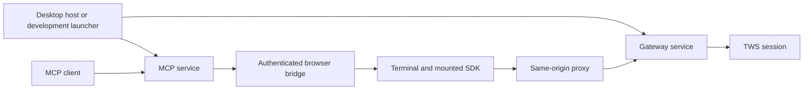

# Workstation architecture

The workspace boundaries follow runtime responsibilities. Shared browser/server
schemas live in `packages/contracts`; Node service lifecycle code lives separately
in `packages/service-runtime`. The terminal continues to use the public
`@tradescript/pro` SDK. Production and desktop builds use the installed package.

## Ownership

| Component | Responsibility |
| --- | --- |
| `apps/gateway/src/service.ts` | Compose configuration, persistence, licensing, HTTP routes and the active broker runtime; return one idempotent `close()` operation. |
| `apps/gateway/src/connections/broker-runtime.ts` | Compose one IB API socket, order-ID allocator, broker state store, feature service and TWS session for a connection generation. |
| `apps/gateway/src/tws/tws-session.ts` | Own connection/reconnection and startup reconciliation. No second component issues a parallel initial account/order snapshot. |
| `apps/gateway/src/ibkr/ibkr-service.ts` | Coordinate broker features and decode events on the injected socket; never open or reconnect that socket. |
| `apps/mcp/src/browser-bridge.ts` | Own one-time pairing tokens, attached sockets and pending requests. Only the exact owning socket can answer or abandon a request. |
| `apps/mcp/src/transport.ts` | Own MCP client transports. |
| `apps/mcp/src/tools.ts` | Register tools/resources and delegate to the mounted SDK through the browser bridge. |
| `apps/mcp/src/service.ts` | Bind loopback HTTP/WebSocket listeners and close the bridge and transports. |
| `apps/terminal/src/workstation-authorization.ts` | Resolve browser authorization, SDK bootstrap and broker readiness before SDK allocation. |
| `apps/terminal/src/workstation.ts` | Own one startup attempt, mount/configure SDK surfaces and register cleanup with `WorkstationLifetime`. |
| `apps/terminal/src/use-workstation.ts` | Connect React mounting, state updates and unmounting to the workstation owner. |

## Desktop and service lifecycle

Gateway and MCP entry points call `runService()`. CLI signals and desktop worker
stop messages therefore execute the same service cleanup. A worker reports ready
only after its service has started. Cleanup failures and startup failures exit
nonzero.

The desktop `ServiceWorkers` owner waits for readiness, detects unexpected exits
(including exit code zero), asks all owned workers to stop, and waits up to three
seconds before terminating an unresponsive worker. A forced termination makes the
desktop runtime exit nonzero. The proxy stops accepting connections during shutdown.

The Rust `Runtime` owner acquires the Node child immediately after spawn, before
startup I/O can fail. It sends the startup configuration over stdin, accepts the
expected ready address, and requests shutdown before falling back to terminating
its own child. It never owns TWS or cancels broker orders.

Development generates its capability in the root launcher. Desktop generates its
capability in the Node runtime, uses an allowlisted worker environment and keeps
desktop data separate from repository development data. Neither path puts pairing
secrets into URLs, logs or workspace layouts.

## Verification

Run `npm run check` and `npm run build` for shared changes. Run
`npm run test:e2e:mock` for rendered simulation and MCP/SDK flows, and
`npm run test:e2e:desktop` for bundled-runtime onboarding, shutdown, port release
and reopening. These suites use isolated processes/state and do not qualify IBKR.

After preparing desktop resources, `npm run test:desktop:native` compiles the Rust
host and exercises child ownership/cleanup on Unix. The desktop release workflow
runs it after preparation. A native-window smoke check is separate from browser
E2E. Paper-TWS verification is described in [testing guide](testing.md); it must retain the
account and order-ownership guards.
